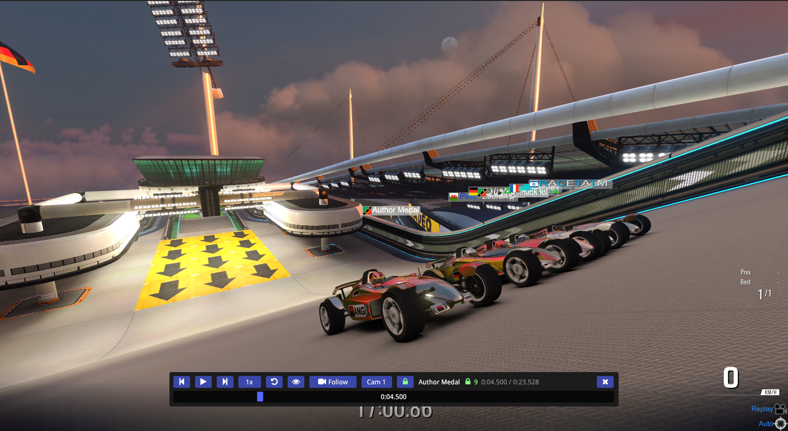
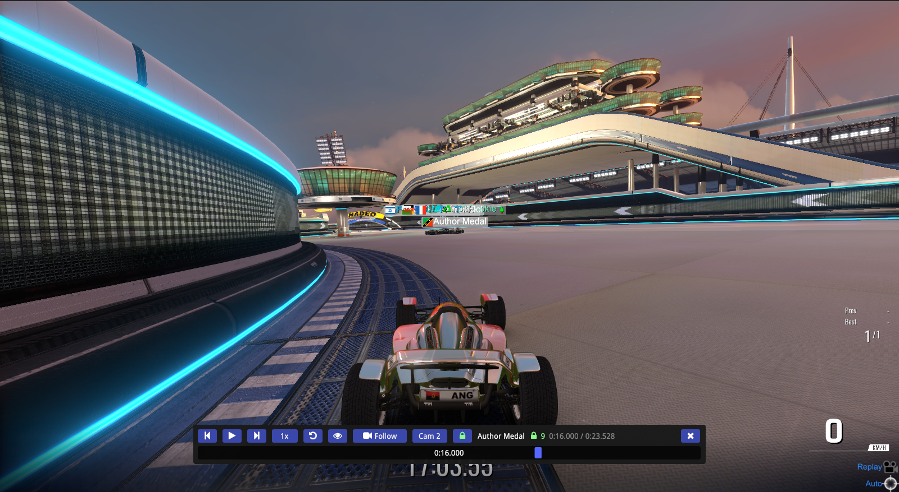
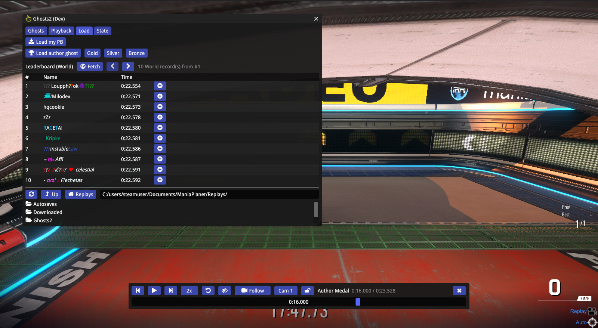
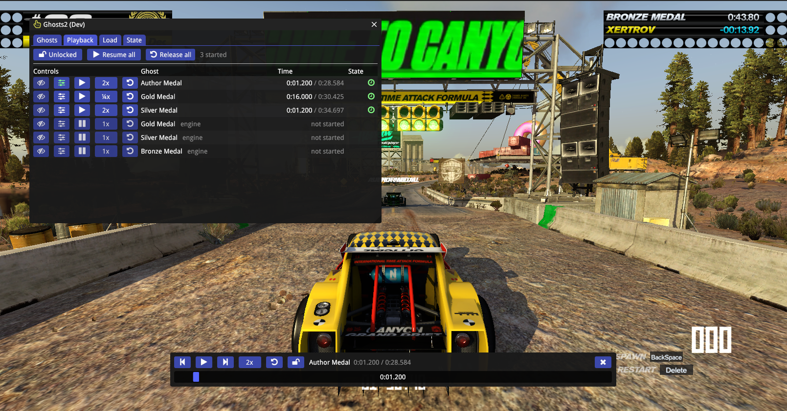
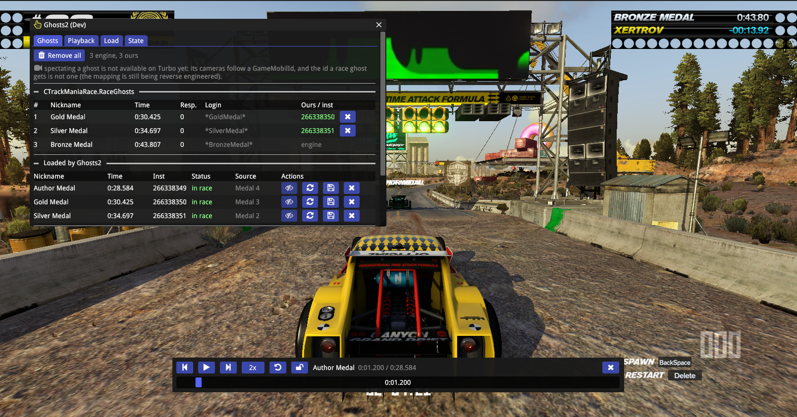
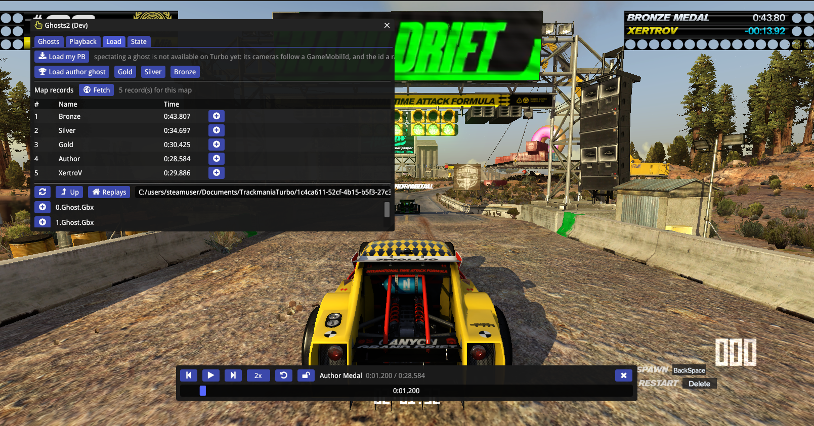

# Ghosts2

Load, scrub, lock, spectate and save race ghosts in **ManiaPlanet 4 / TrackMania 2** *and*
**Trackmania Turbo**, from an [Openplanet](https://openplanet.dev) plugin. A clone of the TM2020 plugin
[Ghosts++](https://openplanet.dev/plugin/ghostspp) rebuilt on the MP4 engine.

> ## 📦 Download
> **Grab the `.op` file from the [Releases page](https://github.com/clankercode/tm-ghosts2/releases/latest)**
> and drop it into your plugins folder — `Documents › ManiaPlanet › Openplanet4 › Plugins` for
> ManiaPlanet 4, `Documents › TrackmaniaTurbo › OpenplanetTurbo › Plugins` for Turbo. Reload plugins from
> the Openplanet menu, or restart the game. The same `.op` runs on both games.



## Features

- **Load ghosts from anywhere** — your PB, the author / gold / silver / bronze medal ghosts, any
  `.Replay.Gbx` / `.Ghost.Gbx` from a folder browser over your Replays folder, and any entry of the
  map's world / zone **leaderboard** (paged, one click per record).
- **Scrub every ghost like a video** — pause, step, seek on a time bar, speeds from ¼x to 4x, and a
  resync that hands the clock back to the game. A paused car is perfectly still and seeks land on
  the exact millisecond: Ghosts2 hooks the engine's per-record clock instead of restarting ghosts.
- **Ghost lock** — one padlock drives every started ghost together and keeps them in sync, so a
  whole leaderboard pack replays as one and late starters join at the group time.
- **Spectate with the camera you want** — Replay (the engine's cinematic clip), Follow with
  **Cam 1 / 2 / 3** (behind far, behind close, internal), the free-fly camera, or the game's own
  spectator controls. Right-click the eye for a picker of every loaded ghost.
- **Stop spectating cleanly** — either restart together with the ghosts (like Ghosts++), or carry on
  from where you are: Ghosts2 knows how to end the engine's spectator camera clip without a respawn.
- **Save** any loaded ghost back to a replay file, remove ghosts one by one or all at once, and keep
  ghosts alive across the mode script's periodic `RaceGhost_RemoveAll` and plugin reloads.
- **Scriptable** — exports for other plugins and a command pack for scripted control.
- **Runs on Trackmania Turbo too** — loading, the map's record table, playback control and the lock all
  work there; see [Trackmania Turbo](#trackmania-turbo) for the one feature that does not yet.

| Follow camera, Cam 2 | Internal camera (Cam 3) |
|---|---|
|  |  |

| Replay camera (engine clip) | Playback tab |
|---|---|
|  |  |

| Load tab: medals, leaderboard, replay files | Ghosts tab |
|---|---|
|  |  |

## Using it

Open the window from the Openplanet **Plugins › Ghosts2** menu. Four tabs:

- **Load** — *Load my PB*, *Load author ghost* (Gold / Silver / Bronze), the leaderboard table
  (*Fetch*, then **+** on a record), and the replay folder browser (**+** on a file).
- **Playback** — one row per started ghost: spectate / scrubber / pause / speed / resync buttons,
  the name, the ghost's time over its race time, and state icons (eye = spectated, clock = clock
  owned by Ghosts2, padlock = in the lock group). The top row toggles the lock, pauses, resumes or
  releases every started ghost at once, and resets the camera.
- **Ghosts** — what the race holds and what Ghosts2 loaded, with per-row remove, re-add, spectate and
  save, plus *Remove all* and the engine's own medal/PB ghost toggles.
- **State** — the current playground, map and hook status.

### Scrubber

The strip at the bottom of the screen opens by itself for the first ghost you load and follows the
Ghosts++ rules: visible during the race countdown, while you spectate and while you drag it; otherwise
it hides 1.5 s after the mouse leaves it, and hovering the (invisible) strip area brings it back
(settings *Scrubber → Show during the race countdown / Auto-hide / Hide delay*).

Buttons: step back / play-pause / step forward (step scales with the speed), speed (click faster,
right-click slower), resync, **eye** (spectate this ghost; right-click for a picker of every ghost;
with the lock on it shows whichever ghost is spectated), **camera** (Replay / Follow / FreeCam / Game,
right-click cycles backwards; in Follow a **Cam 1/2/3** button appears), and the **padlock**.
Right-click on the time bar toggles pause.

### Ghost lock

On by default (*Scrubber → Lock all ghosts by default*). With the lock on, the scrubber, the Playback
rows and the exports drive every started ghost: pause, seek, step and speed apply to all of them, and
each frame the others mirror the scrubber ghost's clock.

### Spectating

The eye writes the ghost's instance id into the game's `SpectatorForcedTarget` and forces you into
spectator mode (what Nadeo's own replay-focus UI does). The camera button picks the spectator camera:

| Camera | What you get |
|---|---|
| **Replay** | the engine's cinematic camera clip |
| **Follow** | chase cam on the ghost; **Cam 1** behind far, **Cam 2** behind close, **Cam 3** internal |
| **FreeCam** | the free-fly camera (cam 7 in TM2020 terms), moved with the game's own free-cam keys |
| **Game** | no override: the game's spectator camera controls apply |

Stopping either **restarts you and the ghosts together** (setting *Spectate → Restart when you stop
spectating*, on by default, same as Ghosts++) or, with that setting off, ends the spectator camera clip
in place so you carry on without a restart. *Reset camera* on the Ghosts / Playback tabs points the
camera back at your car if anything ever leaves it on a ghost.

## Settings

All under **Openplanet › Settings › Ghosts2**: replay folder, auto re-add, time control on/off,
scrubber visibility and step size, lock default, spectate options (force spectator, restart on stop,
respawn delay, camera type, Follow camera, classic-race camera hook), leaderboard zone.

Two of them share a shape worth knowing: **Restart the run when a ghost is added** (Loading) and
**Restart when you stop spectating** (Spectate) are both *Never / Unless mid-lap / Always*, defaulting to
*Unless mid-lap*. A restart is how a queued ghost starts playing and how the engine's spectator camera
clip ends, but it also throws away the lap you are driving - so Ghosts2 does it freely while you are on
the start line and holds off once you are past a checkpoint and still moving. When it holds off, the
Ghosts tab shows a **Restart now** button.

## Exports and command pack

Ghosts2 exports `Ghosts2::ListGhosts`, `Browse`, `LoadReplay`, `LoadPB`, `LoadMedal`, `Remove`, `RemoveAll`,
`Spectate`, `StopSpectating`, `StopSpectatingEx(respawn)`, `State`, `ShowWindow`, `SelectTab`,
`MoveWindow`, `GetGhostTime`, `Seek`, `SetPaused`, `SetSpeed`, `Resync`, `ShowScrubber`, `SetLockAll`,
`SetCameraType`, `SetFollowCam`, `ResetCamera` and the leaderboard calls for other Openplanet scripts
(see `src/Exports.as`). The optional pack in `mp4pack/` (plugin id `tm-ghosts2-mp4pack`) exposes the same
operations to the `tm-mp4-control` plugin as `ghosts2.*` commands
(`list`, `state`, `browse [dir=]`, `load_replay`, `load_pb`, `load_medal`, `lb_fetch`, `lb_list`, `load_lb`, `remove`,
`remove_all`, `spectate`, `stop_spectating [respawn=]`, `cam type=`, `follow_cam cam=`, `cam_reset`,
`lock all=`, `ghost_time`, `seek`, `pause`, `speed`, `resync`, `scrubber`, `show_window`). The pack must
not re-declare the imports: Openplanet compiles a dependency's `exports` files into the dependent module.

## Building from source

```
SKIP_RELOAD=1 ./build.sh dev     # lint (openplanet-lsp, MP4 type db) + stage to ~/Openplanet4/Plugins
./build.sh dev                   # same, plus hot-reload via tm-remote-build
./build.sh release               # produce tm-ghosts2-<version>.op
```

`build.sh` runs `openplanet-lsp check --game-target MP4` first and refuses to stage on errors.
`GAME=turbo ./build.sh dev` targets Trackmania Turbo instead (`--game-target TURBO`, staging into
`~/OpenplanetTurbo/Plugins`, RemoteBuild on the Turbo port). See **Trackmania Turbo** below for what
works there. `./build.sh dev` also reloads the `tm-ghosts2-mp4pack` command pack, because reloading this
plugin unloads anything that depends on it.
`tools/tm2-smoke.sh` runs a live smoke test against the game through the command pack: adds actually
starting, the replay browser, a leaderboard round trip, playback and the lock, spectate/stop and the
camera reset, removal, and hook health. It adapts to what the race can do, so it is also useful in the
legacy solo playground where ghosts cannot be added, at a `CampaignSolo` challenge card where there is no
run to restart, and on Turbo where spectating is refused by design (`GAME=turbo tools/tm2-smoke.sh`).
Current: **21/21 on ManiaPlanet 4** (TimeAttack and a started `CampaignSolo` run) and **19/19 on Turbo**.
`tools/showcase-shots.sh` and `tools/readme-shots.sh` regenerate the screenshots through the command pack
(`GAME=turbo SHOTS=ui tools/showcase-shots.sh <instId>` for the Turbo set).

## How it works (engine notes)

- **Playback control** hooks the engine's per-record clock update (`RaceGhostRecord_UpdatePlaybackTime`,
  `Dev::Hook`) and sets each record's StartTime from the exact tick time, so paused cars do not
  vibrate and seeks land exactly. Resync hands the clock back; a respawn rebuilds the records, which
  releases any owned clock. The setting *Time control* turns the hook off.
- **Starting an added ghost is a plain `SpawnPlayer`, never an unspawn.** `RaceGhost_Add` only queues the
  ghost; the engine builds its playback record at the next spawn. `SpawnPlayer` on an already-spawned
  player is enough to trigger that, on both games and in every mode tried. Unspawning first looks like the
  cleaner restart and does work in TimeAttack, but `CampaignSolo` — the mode behind the game's own SOLO
  campaign, i.e. what most people play — owns spawning: `UnspawnPlayer` takes the car away, drops the
  map's challenge card back over the track, and discards every later `SpawnPlayer` on the same frame.
  Ghosts2 also asks whether there is a run to restart at all: `CampaignSolo` parks the car on the track
  behind that card with `IsSpawned` true but `RaceStartTime` 0, and spawning from there costs you the
  screen you are on. An add made there is **held**, not dropped, and fires the moment you start your run.
- **Auto re-add** — the stock solo mode calls `RaceGhost_RemoveAll()` on every phase transition.
  Ghosts2 keeps the `CGameGhostScript@` handles and puts them back, rate limited, giving up after a
  few failed attempts so it never fights the mode script. `RaceGhost_Add` takes effect at the next
  (re)spawn: the engine keeps a script-facing add list and a live copy rebuilt when the player spawns,
  and Ghosts2 tracks (and, after a reload, adopts) ghosts from both.
- **Stop spectating** — forcing the spectator makes the engine play a spectator camera clip on the
  ghost (`CGameCtnMediaClipPlayer` on the game terminal) that clearing the UI config never stops; only
  a (re)spawn does, or a ref-counted release of the terminal's clip slot a few frames after the UI
  config restore has reached the engine (the no-restart mode). With the Follow / FreeCam / Game cameras
  the camera system's auto target also stays on the ghost, so stopping writes it back to your car.
- **Follow Cam 1/2/3** — the engine hard-codes the far chase cam for the forced Follow spectator
  camera; Ghosts2 writes the chosen vehicle cam id into the camera system from its camera-target hook,
  which runs right before the camera update reads it.
- **Classic race camera hook** — in the campaign race (`CTrackManiaRace1P`) the engine never copies
  `SpectatorForcedTarget` into the camera, so Ghosts2 hooks the camera target resolver and writes the
  ghost's id into the forced-target slot right before it is read (setting *Camera hook (classic race)*).
  All hooks are removed on unload.

The research behind these lives in the `openplanet/research/mp4/` notes (Ghidra decompiles and runtime
notes; engine build `2019-11-19_18_50`, Openplanet 1.29.14).

## Trackmania Turbo

Ghosts2 runs on Trackmania Turbo, and almost everything works. **Correction to the 0.4.0 notes: Turbo
*does* have a mode script.** The earlier reading came from the legacy `CTrackManiaRace1P` playground,
which is equally ruleless on ManiaPlanet 4. Launch a map through the campaign flow (INSERT COIN →
CAMPAIGN → SOLO CAMPAIGN → a series → a map) and the playground is a `CTrackManiaRaceNew` driven by a
real `CTrackManiaRaceRules` with `ServerModeName` `TMC_CampaignSolo`, the whole `RaceGhost_*` surface,
`SpawnPlayer`, `UIManager`, `DataMgr` and `ScoreMgr`.

| Playback tab: three medal ghosts at mixed speeds | Ghosts tab |
|---|---|
|  |  |



What works on Turbo, all measured live on campaign map 003:

- **Loading** — author / gold / silver / bronze medal ghosts, and *Load my PB*. Gold, silver and bronze
  come from `DataMgr.Ghosts`, which the engine fills when the campaign map loads: offline, instantly,
  no web task. The author ghost is never preloaded, so Ghosts2 pulls it out of the map's record table
  instead (see below) — it costs one fetch and then behaves like any other ghost.
- **The map's record table as a leaderboard** — `DataMgr.RetrieveRecords(MapInfo, UserId)` fills
  `DataMgr.Records` with the medal times *and* your own record, each row carrying a `GhostUrl` that
  `GhostRetrieve` accepts. It is local and works with no network at all, so the Load tab calls it
  **Map records** rather than pretending there is a world leaderboard.
- **Adding ghosts, and the restart that starts them** — `RaceGhost_Add` plus a `SpawnPlayer`, exactly as
  on ManiaPlanet 4.
- **Playback control with no hook at all.** Nothing on Turbo rewrites a ghost record's start time per
  frame, so Ghosts2 simply holds `record + 0x0c = rules.Now - wanted` from its own `Update()`. Measured:
  a paused ghost holds its millisecond over 3 s, seeks land exactly, 2x measures 2.1x.
- **The lock, the scrubber, removal, re-add and the save path** (Turbo has no replay-file writer, so
  saving goes through `DataMgr.StoreRecordName` — which writes into the map's own record table as *your*
  record, so Ghosts2 asks for confirmation first).

What does **not** work yet:

- **Spectating a ghost.** Turbo's `CGamePlaygroundUIConfig` has no `SpectatorForcedTarget` /
  `ForceSpectator` at all. The camera set is reachable and writable
  (`CurrentPlayground.GameTerminals[0].CameraSet.CamsMaster`, `ManagedCams[i].FollowedGameMobilId`) and
  the writes land — but a race ghost's instance id is not a `GameMobilId` (the local player's own mobil
  reports id 0), so the view does not move. Rather than write an id nothing follows and quietly detach
  your camera, Ghosts2 refuses, hides the camera controls and says why. The plumbing is in place for the
  moment that mapping is known.
- **The engine's own race ghosts** (the medal opponents the game itself puts in the race) list but have
  no playback record Ghosts2 can resolve, so they cannot be scrubbed. Load the same medals through the
  Load tab and they are fully drivable.
- **`.Ghost.Gbx` files.** A Turbo profile's `MapsGhosts/` folder holds ~20-byte index stubs, not ghost
  data, and `GhostRetrieve` takes urls rather than file paths. The browser still opens there (there is no
  Replays folder on Turbo) and says so plainly rather than failing silently.

Two things about Turbo that are easy to lose an afternoon to:

- **Turbo pauses whenever its window loses focus** — arcade-port behaviour. The playground clock freezes
  behind an INSERT COIN / CAMPAIGN panel. Any timing measurement needs the window focused, or you will
  measure a stopped clock and conclude your pause is perfect.
- **`UnspawnPlayer` is destructive there** — it drops the playground to the arcade attract mode and never
  comes back. Ghosts2 never calls it (on either game; see *How it works*).

Measured detail: `openplanet/research/turbo/2026-09-08-Turbo-Setup.md`.

## Known limitations

- **The hooks target engine build 2019-11-19_18_50.** Prologue bytes are checked before hooking and each
  feature disables itself on a mismatch; the script API alone only offers the forward-only
  `RaceGhost_AddWithOffset`.
- **Ghost identity is a heuristic** for engine-loaded ghosts (`CGameCtnGhost.Id` is `0xffffffff`), so
  they are matched by stripped nickname + race time.
- **`DataFileMgr` is documented as "only available for local solo modes"**, so replay loading and saving
  are expected to be unavailable online.
- **Saving writes `.Replay.Gbx`** (MP4 has no `Ghost_Save`), under `Replays/Ghosts2/`.
- Only ghosts loaded by Ghosts2 (or adopted from the race) can be removed individually, spectated or
  saved; the engine's own medal/PB ghosts have no instance id.
- **The legacy solo playground (`CTrackManiaRace1P`) will not take new ghosts.** That is the race you get
  from the classic Campaigns menu: its `CTrackManiaRaceRules` nod has an empty `Players` list, so
  `RaceGhost_Add` returns `MwId(0)` and there is nobody for `SpawnPlayer` to restart. Everything else
  works there - the opponents you picked in the game's own dialog are listed, scrubbed, locked together
  and spectated as usual. A script-driven race (`CTrackManiaRaceNew`) takes ghosts normally.
- **The game's own race ghosts cannot be taken out of the race**; Ghosts2 checks whether a removal landed
  and tells you when it did not, rather than dropping the row and letting the ghost reappear.
- **In `CampaignSolo`, a ghost added at the map's challenge card waits for your start.** That screen is
  not a run — the car is parked on the track behind it — and asking the engine for a spawn from there
  takes the car away. Ghosts2 holds the restart and fires it as soon as you begin, so the ghost starts
  with you; the status line says which of the two happened.
- **On Turbo, spectating a ghost and scrubbing the engine's own race ghosts are not available**, and
  `.Ghost.Gbx` files cannot be loaded. See [Trackmania Turbo](#trackmania-turbo).
- **Your race HUD stays on screen while you spectate**, showing a frozen chrono. Setting the
  `OverlayHide*` fields (even `OverlayHideAll`) on `rules.UIManager.UIAll` does not affect it - the
  writes stick but the HUD does not change - so the solo HUD is driven from somewhere else. Still open.

## Notes for agents

Verified against `~/Openplanet4/Openplanet.h` + `Openplanet4.json` (engine build
`2019-11-20 04:50:52`, Openplanet 1.29.14) and the research notes under
`~/src/openplanet/research/mp4/`.

**Exists and is used:**

| API | Signature |
|---|---|
| `CTrackManiaRaceRules.RaceGhost_Add` | `MwId (CGameGhostScript@ Ghost, bool DisplayAsPlayerBest)` |
| `CTrackManiaRaceRules.RaceGhost_AddWithOffset` | `MwId (CGameGhostScript@, uint OffsetMs)` — offset is **unsigned**, forward-only |
| `CTrackManiaRaceRules.RaceGhost_Remove` / `_RemoveAll` | `void (MwId)` / `void ()` |
| `CGameDataFileManagerScript.Replay_Load` | `CWebServicesTaskResult_GhostListScript@ (wstring Path)`, `.Ghosts` is `MwFastBuffer<CGameGhostScript@>` |
| `CGameDataFileManagerScript.Replay_Save` | `CWebServicesTaskResult@ (wstring Path, CGameCtnChallenge@ Map, CGameGhostScript@ Ghost)` |
| `CGameDataFileManagerScript.Ghost_Download` | `CWebServicesTaskResult_GhostScript@ (string FileName, string Url)` — leaderboard entries carry both |
| `CGameDataFileManagerScript.TaskResult_Release` | `void (MwId TaskId)` — also on `ScoreMgr` |
| `CGameScoreAndLeaderBoardManagerScript.Map_GetRecordGhost` | `CWebServicesTaskResult_GhostScript@ (MwId UserId, string MapUid, string Context)`, `.Ghost` |
| `CGameScoreAndLeaderBoardManagerScript.MapLeaderBoard_GetPlayerList` | `(MwId(0), mapUid, "", zone, offset, count)` → `CGameNaturalLeaderBoardInfoScript` entries |
| `CWebServicesTaskResult` | `Id`, `IsProcessing`, `HasSucceeded`, `HasFailed`, `IsCanceled`, `ErrorType/Code/Description` |
| `CGamePlaygroundUIConfig` | `SpectatorForcedTarget`, `SpectatorAutoTarget`, `ForceSpectator`, `SpectatorForceCameraType`, `UISequence` (all writable) |
| `CGameGhostScript` | only `Id`, `Result` (`CTmRaceResultNod`, `.Time` is `int`), `Nickname` |
| `CGameCtnGhost` | `GhostLogin`, `GhostNickname`, `RaceTime`, `NbRespawns`, `EventsDuration`, `Validate_*` |
| `MwId` | value type with `MwId()`, `MwId(uint)`, `opEquals`, `GetName/SetName`, `.Value` |
| `CMwNod.Id` | every nod has an `MwId Id`, which is how the local user id is obtained from `rules.Users[i]` |

**Does not exist in MP4** (present in TM2020 / Ghosts++, do not port):

- `NGameGhostClips_SMgr`, `CGameGhostMgrScript` — no ghost-clip manager at all.
- `CGamePlaygroundUIConfig.Spectator_SetForcedTarget_Ghost` — write the plain `SpectatorForcedTarget` field instead.
- `CSmArenaRulesMode.Ghosts_SetStartTime` — no start-time setter (Ghosts2 hooks the clock instead).
- `DataFileMgr.Ghost_Save` — only `Replay_Save`.
- `CGamePlaygroundScript.ModeName` — detect the mode by `app.PlaygroundScript` being a `CTrackManiaRaceRules`.
- MLHook and any `SendCustomEvent` event bus — drive `CTrackManiaRaceRules` methods directly.

**Verified in-game (TimeAttack on A01, and the classic campaign race):**

1. `LocalUserId()` (`rules.Users[i].Id` matched by `GetLocalLogin()`) is the id `Map_GetRecordGhost` wants.
2. `SpectatorForcedTarget` written from Openplanet sticks; the camera follows the ghost until the values are restored.
3. In script modes `RaceGhosts` stays empty, so plugin ghosts are tracked per instance with
   `RaceGhost_GetStartTime` / `IsVisible`; the nickname+time match is only used for the classic race list.
4. `Replay_Save` accepts a bare filename and writes under the game's `Replays` folder; `Replay_Load` reads it back.
5. Releasing a task result while holding its `CGameGhostScript@` keeps the ghost usable.

### Trackmania Turbo deltas

Verified against `~/OpenplanetTurbo/OpenplanetTurbo.json` (32-bit build, Openplanet 1.29.14). Turbo's
`CTrackManiaRaceRules` is nearly the ManiaPlanet one; `src/Compat.as` holds every difference.

| Missing on Turbo | What Ghosts2 does instead |
|---|---|
| `RaceGhost_IsVisible` | vanished-ghost detection runs on `RaceGhost_GetStartTime` + add-list membership |
| `RaceGhost_GetPosition` | not needed by any current feature |
| `CTmRaceRulesPlayer.IdleDuration` / `.Speed` | mid-lap detection tracks `.Position` itself (20 cm threshold) |
| `CGamePlaygroundUIConfig.SpectatorForcedTarget` / `ForceSpectator` / `SpectatorForceCameraType` | nothing yet — spectating is refused, see above |
| `DataFileMgr` (the whole manager) | `CGameDataManagerScript` off `rules.DataMgr` / the title ManiaApp |
| `ScoreMgr.Map_GetMultiAsyncLevelRecordGhost` | `DataMgr.Ghosts` for gold/silver/bronze, `DataMgr.Records[i].GhostUrl` for the author |
| `ScoreMgr.MapLeaderBoard_GetPlayerList` | `DataMgr.RetrieveRecords(MapInfo, UserId)` → `DataMgr.Records` |
| `DataFileMgr.Replay_Load` / `Replay_Save` | `DataMgr.GhostRetrieve(url)` / `DataMgr.StoreRecordName(...)` |
| `CGameGhostScript.Result` | `.RaceResult` |

Ghost record layout, measured live (stride and field offsets differ from MP4 — `src/TimeControl.as` has
both sets): add entries at `race+0x0c4/0x0c8` (script) and `race+0x3ac/0x3b0` (live), playback records at
`race+0x3b8`, classic wrappers at `race+0x59c/0x5a0`; a record is `+0x04` ghost, `+0x0c` StartTime
(`0xffffffff` = not started), `+0x10` started, `+0x1c` displayAsPB, `+0x24` instance id — and there is no
elapsed field, the engine computes it on demand.

Hazards found the hard way, so nobody repeats them:

- A **generic Reflection sweep** over Turbo nods hangs Openplanet's script engine (game alive, plugin
  socket dead, RemoteBuild refuses). Walk `MwClassInfo.GetMember(name)` by name instead.
- `CTrackManiaMenus.MenuCampaignChallenges_Solo()` hangs it the same way.
- `DialogQuickChooseGhostOpponents()` kills the whole process — on **ManiaPlanet**, not just Turbo.
- `CGameManiaApp::LayerCustomEvent` wants `MwFastBuffer<wstring>`, not `string[]`; `openplanet-lsp`
  accepts the latter and the game rejects it.

## Credits

- [Ghosts++](https://openplanet.dev/plugin/ghostspp) (TM2020) for the feature set and UI this plugin imitates.
- **FortTM** for the leaderboard ghost flow (`MapLeaderBoard_GetPlayerList` with `MwId(0)`, an empty context
  and a zone name; `FileName`/`ReplayUrl` on each entry; `Ghost_Download` taking them directly).
- Created by [Max Kaye (XertroV)](https://xk.io) + AI.

## License

Dual-licensed under the [Unlicense](https://unlicense.org) and
[CC0 1.0](https://creativecommons.org/publicdomain/zero/1.0/), at your option. See `LICENSE`.
