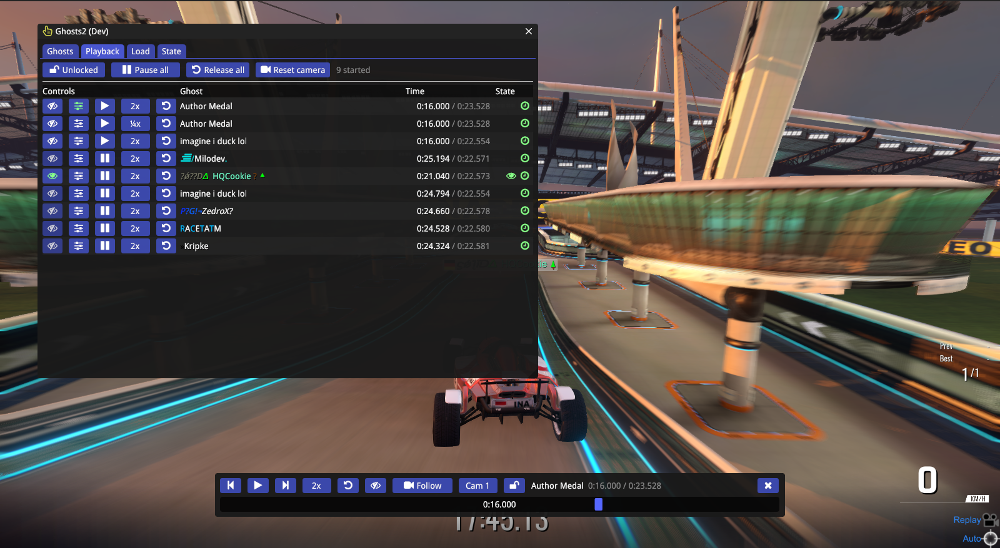
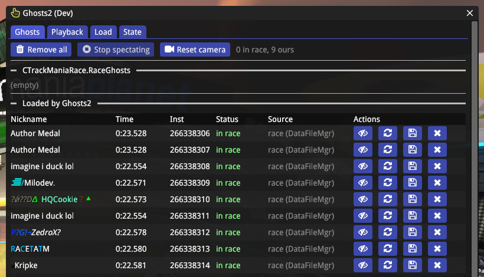
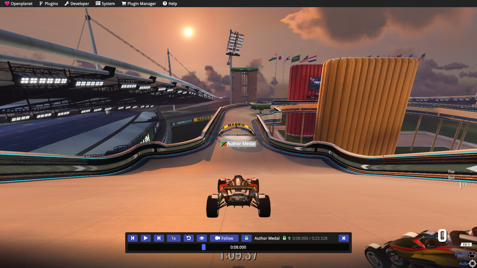

# Ghosts2

An Openplanet plugin for **ManiaPlanet 4 / TrackMania 2** that lists, loads, removes and
spectates race ghosts. It is a small clone of the TM2020 plugin
[Ghosts++](../tm-ghosts-plus-plus), rebuilt on the MP4 API (`CTrackManiaRaceRules.RaceGhost_*`)
rather than the TM2020 ghost-clip manager.

 



## What it does

- **Ghosts tab**
  - Lists every entry of `CTrackManiaRace.RaceGhosts`: nickname, race time, respawns, login,
    and — for ghosts this plugin added — the `MwId` returned by `RaceGhost_Add`.
  - Lists the ghosts Ghosts2 loaded, with per-row **remove**, **re-add**, **spectate** and
    **save**, plus **Remove all** (`RaceGhost_RemoveAll`).
  - Shows `PlayerBestGhost` / `PlayerRecordedGhost` and toggles for the free engine ghosts
    (`IsBestRaceGhostVisible`, `MedalGhost_ShowGold/Silver/Bronze`).
- **Playback tab** — one row per started ghost: spectate / scrubber / pause / speed / resync buttons
  on the left, the name, the ghost's time over its race time, and state icons (eye = spectated, clock =
  clock owned by Ghosts2, padlock = in the lock group) on the right. The top row toggles the lock
  and pauses, resumes or releases every started ghost at once.
- **Load tab**
  - A folder browser over the game's `Replays` folder (`IO::FromUserGameFolder("Replays")`,
    overridable in settings) listing `*.Replay.Gbx` / `*.Ghost.Gbx`. Loading runs
    `DataFileMgr.Replay_Load` in a coroutine and adds every returned ghost to the race.
  - **Load my PB** via `ScoreMgr.Map_GetRecordGhost(localUser, mapUid, "")`.
  - **Load author/gold/silver/bronze ghost** via `ScoreMgr.Map_GetMultiAsyncLevelRecordGhost`
    (levels 4/3/2/1). Nadeo campaign maps only — TMX maps have no medal ghosts, so failures
    and null ghosts notify.
- **Spectate** — writes the ghost's instance `MwId` to `UIAll.SpectatorForcedTarget` (what
  Nadeo's `UISequences::SetReplayGhostFocus` does), optionally with `ForceSpectator` and
  `UISequence = EndRound`. Stopping restores the previous values and **restarts you and the
  ghosts** (setting *Spectate → Restart when you stop spectating*): forcing the spectator makes
  the engine play a spectator camera clip on the ghost (`CGameCtnMediaClipPlayer` on the game
  terminal) that clearing the UI config never stops; only a (re)spawn of your car does. Ghosts++
  does the same. With the setting off, Ghosts2 instead releases the terminal's spectator clip slot
  itself (a ref-counted drop of `CGameTerminal+0xa8`, a few frames after the UI config restore has
  reached the engine) and you carry on without a restart. With the Follow / FreeCam / Game cameras
  the camera system's auto target id stays on the ghost even after a respawn, so stopping also
  writes it back to the local vehicle ("Reset camera" on the Ghosts / Playback tabs does the same
  by hand).
- **Playback control** — per ghost (plugin-loaded instances in script modes, and the engine's own
  medal/PB ghosts in the classic campaign race): pause/resume, speed (¼x … 4x), step ±100 ms, seek,
  plus a Ghosts++-style scrubber strip at the bottom of the screen. Ghosts2 hooks the engine's
  per-record clock update (`RaceGhostRecord_UpdatePlaybackTime`, `Dev::Hook`) and sets the record's
  StartTime from the exact tick time, so a paused car is perfectly still and seeks land exactly;
  "resync" hands the clock back to the game (the ghost snaps to the player's race time). A respawn
  rebuilds the engine's records, which releases any owned clock. Setting `Time control` turns the
  hook off.
- **Auto re-add** (on by default) — the stock solo mode calls `RaceGhost_RemoveAll()` on every
  phase transition, silently wiping plugin ghosts. Ghosts2 keeps the `CGameGhostScript@`
  handles and puts them back, rate limited, giving up after a few failed attempts so it can
  never end up in an add/remove fight with the mode script. The retained list is cleared on
  map change. Removal detection queries each tracked instance (`RaceGhost_GetStartTime` /
  `IsVisible`) — `RaceGhosts` is empty in script modes — and only treats an instance as
  removed once it previously reported `startTime > 0` (a fresh add reports 0 until the
  player starts).

## Exports and MP4 command pack

Ghosts2 exports `Ghosts2::ListGhosts`, `LoadReplay`, `LoadPB`, `LoadMedal`, `Remove`,
`RemoveAll`, `Spectate`, `StopSpectating`, `State`, `ShowWindow`, `GetGhostTime`, `Seek`,
`SetPaused`, `SetSpeed`, `Resync` and `ShowScrubber` for other Openplanet scripts. The optional `ghosts2` pack (`mp4pack/`, plugin id `tm-ghosts2-mp4pack`,
build with `mp4pack/build.sh`) exposes the same operations through
`tm-mp4-control/tools/mp4call.py ghosts2.list` (subcommands: `state`, `load_replay`,
`load_pb`, `load_medal`, `remove`, `remove_all`, `spectate`, `stop_spectating`,
`show_window visible= [tab=ghosts|playback|load|state] [x= y=]`, `ghost_time instId=`, `seek instId= ms=`, `pause instId= paused=`,
`speed instId= speed=`, `resync instId=`, `scrubber instId= visible=`). The pack must not re-declare the imports: Openplanet compiles a
dependency's `exports` files into the dependent module.

## Build

```
SKIP_RELOAD=1 ./build.sh dev     # lint (openplanet-lsp, MP4 type db) + stage to ~/Openplanet4/Plugins
./build.sh dev                   # same, plus hot-reload via tm-remote-build
./build.sh release               # produce tm-ghosts2-<version>.op
```

`build.sh` runs `openplanet-lsp check --game-target MP4` first and refuses to stage on errors.

## Scrubber

The strip at the bottom of the screen opens by itself for the first ghost you load and follows the Ghosts++
rules: it is visible during the race countdown, while you spectate and while you drag it; otherwise it hides
1.5 s after the mouse leaves it, and hovering the (invisible) strip area brings it back. Settings *Scrubber →
Show during the race countdown / Auto-hide / Hide delay*. Right-click on the time bar toggles pause; the speed
button's right-click cycles speeds backwards. With the lock on, the eye shows whichever ghost is being spectated
and stops it; right-click the eye for a picker listing every loaded ghost. The camera button next to it cycles the
spectator camera: **Replay** (the engine's camera clip), **Follow** (chase cam; a **Cam 1 / 2 / 3** button next to it picks behind-far / behind-close / internal, which the engine's forced Follow camera cannot do on its own), **FreeCam** (the free camera, cam 7 in TM2020 terms) and
**Game** (`SpectatorForceCameraType = 15`: the game's own spectator camera controls apply). Pack:
`ghosts2.cam type=0|1|2|15`. Names are rendered through `Text::OpenplanetFormatCodes`.

## Ghost lock

The padlock on the scrubber (on by default, setting *Scrubber → Lock all ghosts by default*) locks every started
ghost together: the scrubber, the per-ghost playback buttons and the exports/pack commands then pause, seek, step
and change speed for all of them, and each frame the others mirror the scrubber ghost's clock, so they stay in sync
and a ghost that starts later joins at the group time. Pack: `ghosts2.lock all=true|false`.

## Leaderboard ghosts

The Load tab fetches the map's leaderboard (zone from settings, default `World`, paged) and adds any record's ghost
to the race. This is the game's own add-opponent flow: `ScoreMgr.MapLeaderBoard_GetPlayerList(MwId(0), mapUid,
"", zone, offset, count)` returns `CGameNaturalLeaderBoardInfoScript` entries with rank, name, score and a
`FileName` + `ReplayUrl`; `DataFileMgr.Ghost_Download(FileName, ReplayUrl)` fetches the ghost, then
`RaceGhost_Add`. Pack commands: `ghosts2.lb_fetch offset=`, `ghosts2.lb_list`, `ghosts2.load_lb rank=`.

## Camera target hook (classic race)

In the classic campaign race (`CTrackManiaRace1P`) the engine never copies `SpectatorForcedTarget` into the camera, so
"Spectate" only made the player a spectator while the chase cam stayed on their car. Ghosts2 hooks the camera
target resolver (`CGameCameraSystem`, RVA 0xb44740) and writes the spectated ghost's instance id into the camera's
forced-target slot (+0x4c) right before it is read; the engine clears that slot every frame, so a plain write never
survives. Setting: **Spectate → Camera hook (classic race)**. Both hooks are removed on unload.

## Known limitations

- **Playback control hooks engine build 2019-11-19_18_50** (`RaceGhostRecord_UpdatePlaybackTime` at
  image offset 0x848f20; the prologue bytes are checked before hooking and the feature disables
  itself on a mismatch). The script API itself only offers the forward-only `uint OffsetMs` of
  `RaceGhost_AddWithOffset`.
- **Ghost identity is a heuristic.** `CGameCtnGhost.Id` is `0xffffffff` for engine-loaded
  ghosts, so plugin ghosts are matched to `RaceGhosts` rows by stripped nickname + race time.
  Two identical runs by the same name are matched 1:1 by count, but cannot be told apart.
- **`DataFileMgr` is documented by Nadeo as "only available for local solo modes"**, so
  replay loading and saving are expected to be unavailable online.
- **Saving writes `.Replay.Gbx`, not `.Ghost.Gbx`.** MP4 has no `Ghost_Save`; only
  `Replay_Save(Path, Map, Ghost)`. It is passed a bare filename, which the engine resolves
  inside the Replays folder (that is how Nadeo's own save-ghost UI calls it).
- Only ghosts loaded *by this plugin* can be removed individually, spectated or saved —
  engine ghosts have no instance id and no `CGameGhostScript` handle we can reach.
- **`RaceGhost_Add` takes effect at the next (re)spawn.** The engine keeps two add lists: the
  script-facing one (`race+0x1d0`, where Add/Remove act) and the live copy (`race+0xdd0`, rebuilt
  from it when the player spawns, together with the playback records). A ghost added mid-run has
  no playback until you restart; Ghosts2 tracks (and, after a reload, adopts) ghosts from both lists.

## Notes for agents

Verified against `~/Openplanet4/Openplanet.h` + `Openplanet4.json` (engine build
`2019-11-20 04:50:52`, Openplanet 1.29.14) and the research notes under
`~/src/openplanet/research/mp4/`.

**Exists and is used:**

| API | Signature |
|---|---|
| `CTrackManiaRaceRules.RaceGhost_Add` | `MwId (CGameGhostScript@ Ghost, bool DisplayAsPlayerBest)` |
| `CTrackManiaRaceRules.RaceGhost_AddWithOffset` | `MwId (CGameGhostScript@, uint OffsetMs)` — offset is **unsigned**, forward-only |
| `CTrackManiaRaceRules.RaceGhost_Remove` / `_RemoveAll` | `void (MwId)` / `void ()` |
| `CGameDataFileManagerScript.Replay_Load` | `CWebServicesTaskResult_GhostListScript@ (wstring Path)`, `.Ghosts` is `MwFastBuffer<CGameGhostScript@>` |
| `CGameDataFileManagerScript.Replay_Save` | `CWebServicesTaskResult@ (wstring Path, CGameCtnChallenge@ Map, CGameGhostScript@ Ghost)` |
| `CGameDataFileManagerScript.TaskResult_Release` | `void (MwId TaskId)` — also on `ScoreMgr` |
| `CGameScoreAndLeaderBoardManagerScript.Map_GetRecordGhost` | `CWebServicesTaskResult_GhostScript@ (MwId UserId, string MapUid, string Context)`, `.Ghost` |
| `CWebServicesTaskResult` | `Id`, `IsProcessing`, `HasSucceeded`, `HasFailed`, `IsCanceled`, `ErrorType/Code/Description` |
| `CGamePlaygroundUIConfig` | `SpectatorForcedTarget`, `SpectatorAutoTarget`, `ForceSpectator`, `SpectatorForceCameraType`, `UISequence` (all writable) |
| `CGameGhostScript` | only `Id`, `Result` (`CTmRaceResultNod`, `.Time` is `int`), `Nickname` |
| `CGameCtnGhost` | `GhostLogin`, `GhostNickname`, `RaceTime`, `NbRespawns`, `EventsDuration`, `Validate_*` |
| `MwId` | value type with `MwId()`, `MwId(uint)`, `opEquals`, `GetName/SetName`, `.Value` |
| `CMwNod.Id` | every nod has an `MwId Id`, which is how the local user id is obtained from `rules.Users[i]` |

**Does not exist in MP4** (present in TM2020 / Ghosts++, do not port):

- `NGameGhostClips_SMgr`, `CGameGhostMgrScript` — no ghost-clip manager at all.
- `CGamePlaygroundUIConfig.Spectator_SetForcedTarget_Ghost` — write the plain
  `SpectatorForcedTarget` field instead.
- `CSmArenaRulesMode.Ghosts_SetStartTime` — no start-time setter; remove and re-add with an
  offset.
- `DataFileMgr.Ghost_Save` — only `Replay_Save`.
- `CGamePlaygroundScript.ModeName` — there is no mode-name string. Detect the mode by
  `app.PlaygroundScript` being a `CTrackManiaRaceRules`; `ServerModeName` is empty offline.
- MLHook and any `SendCustomEvent` event bus — the solo mode chain has none; drive
  `CTrackManiaRaceRules` methods directly.

**Verified in-game (2026-09-07, TimeAttack on A01):**

1. `LocalUserId()` (`rules.Users[i].Id` matched by `GetLocalLogin()`) is the id
   `Map_GetRecordGhost` wants: `Load my PB` returns the local record ghost.
2. `SpectatorForcedTarget` written from Openplanet sticks; the camera follows the ghost until
   `Stop spectating` restores the saved values.
3. In script modes `RaceGhosts` stays empty, so plugin ghosts are tracked per instance with
   `RaceGhost_GetStartTime` / `IsVisible`; the nickname+time match is only used for the
   classic race list.
4. `Replay_Save` accepts a bare filename and writes under the game's `Replays` folder
   (`Replays/Ghosts2/<name>.Replay.Gbx`); `Replay_Load` reads it back.
5. Releasing a task result while holding its `CGameGhostScript@` keeps the ghost usable
   (medal/PB ghosts are added after `TaskResult_Release`).

## Credits

- **FortTM**: the leaderboard ghost flow (`MapLeaderBoard_GetPlayerList` argument convention with `MwId(0)`, an empty
  context and a zone name; the `FileName`/`ReplayUrl` on each leaderboard entry; `Ghost_Download` taking them
  directly), traced from what the game does when adding an opponent from the leaderboard dialog.
- Ghosts++ (TM2020) for the feature set and UI this plugin imitates.
